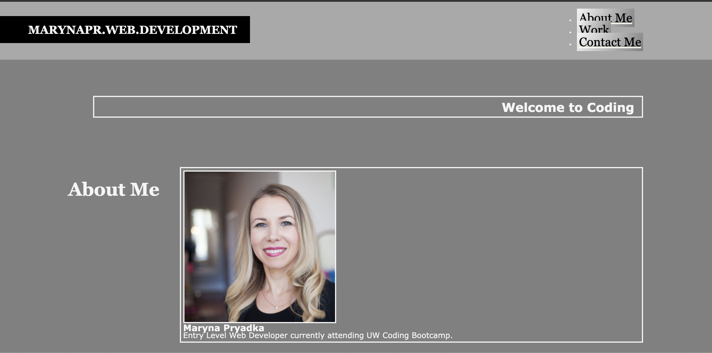
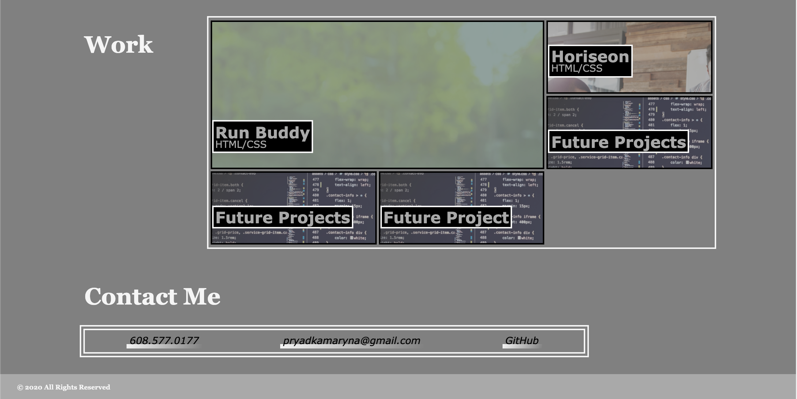

# Portfolio
## Description 

This application demonstrates usage of Flexbox in the Header, Flex in Navigation, Footer and Hero Sections. Media queries are introduced to better serve different screen sizes. Grid Alignment featured in the main section. 
## Technology Used
* HTML5
* CSS

## Web Access

Click here to the [Portfolio] access (https://marynapr.github.io/Portfolio/)

 This document was created by MarynaPR. Feel free to contact me with any questions via email pryadkamaryna@gmail.com